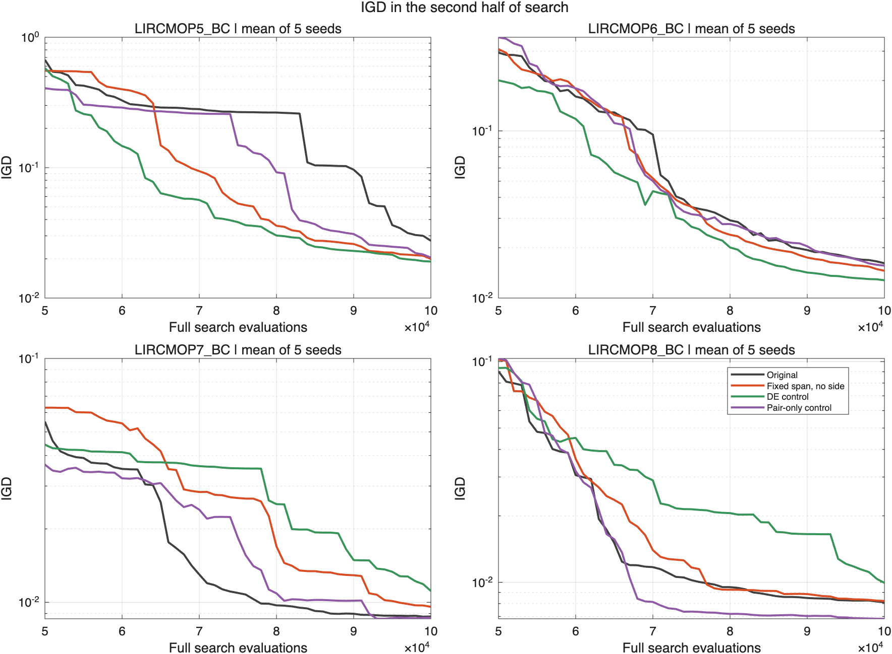
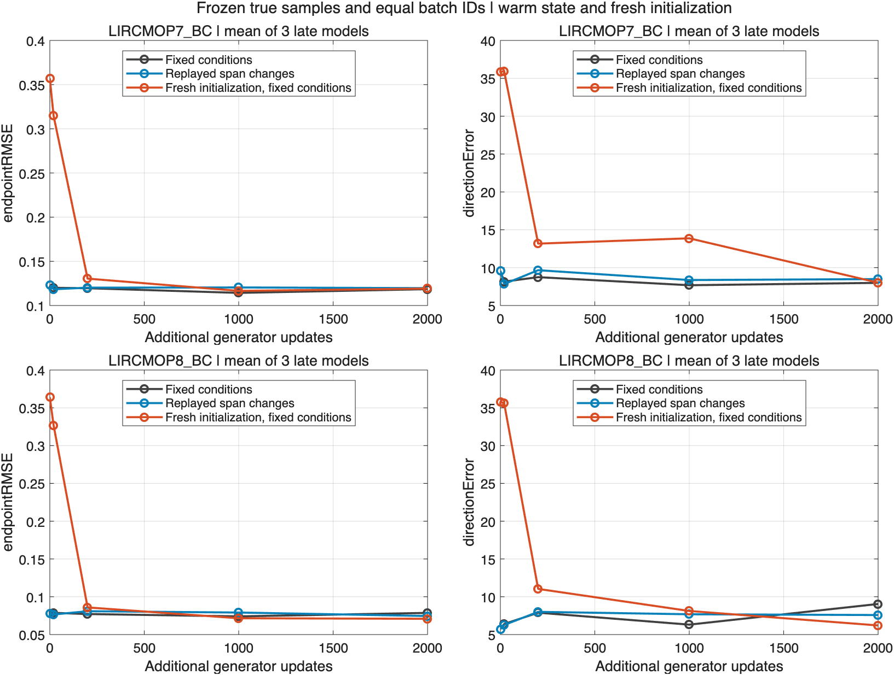
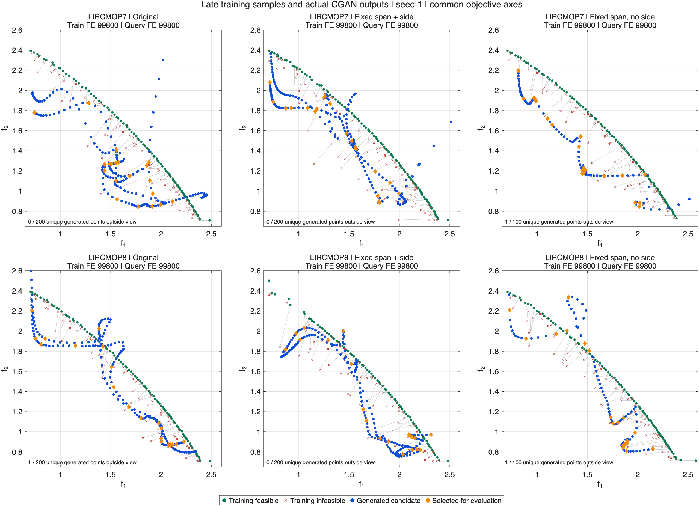

**GPT 建议的实验核验结果**

GPT 指出的跨事件方向条件漂移是真实存在的，但固定首训尺度并未带来统一收益。固定尺度并删除可行性条件 s 的组合，在独立新种子上的后半程 IGD 配对几何平均比值为 **1.095**，相对原版变差 **9.5%**。最终 IGD 改善约 6.6%，但主要指标的初筛收益未复现，不能认定后期生成能力已恢复。**本轮不将这些修改升级为默认方案。**

来源：[GPT 原分析](https://chatgpt.com/share/6a9f698f-7b90-83ea-908a-07b4ea22bb3f)。详细解释与逐项复算见 [SOURCE_REVIEW.md](SOURCE_REVIEW.md)、[verified_scale_claims.csv](verified_scale_claims.csv)。

本轮新增 **104 次完整搜索**：24 次初筛、80 次独立复核；另外完成 48 个同前缀短窗口、12 个固定条件/重放条件对照和 6 个同结构新初始化诊断。此前 36 次完整对照直接复用。所有完整搜索均为 100000 FE，P1/P2、存档、20% P1 引导配额和真实评价规则未改；G/D 均为 [32,32]，首训 1000、后续 20 次 G 更新，保持权重和 Adam。训练、生成噪声均为 0。没有增加辅助网络或坐标条件。

主要指标是 50000–100000 FE 的 IGD 曲线面积除以 50000，使用每 1000 FE 的 51 个状态。下表为候选/对照的配对几何平均比值，**小于 1 较好**。跨题目不直接相加不同量级的改善幅度；完整均值、标准差和逐个种子结果均保留在 CSV。

初筛使用种子 1–3。仅固定尺度的比值为 1.123，7/12 次改善；固定尺度并去 s 为 0.931，8/12 次改善，但最终 IGD 比值为 1.048。按预先写明的规则，选择后者用种子 11–15 独立复核，未根据新种子调参。

| 问题 | 初筛：固定尺度/原版 | 初筛：去 s 组合/原版 | 新种子：组合/原版 | 新种子：组合/DE | 新种子：组合/配对 |
| --- | --- | --- | --- | --- | --- |
| LIRCMOP5_BC | 0.870 | 1.115 | 0.906 | 1.382 | 1.348 |
| LIRCMOP6_BC | 1.460 | 1.403 | 0.919 | 1.667 | 0.936 |
| LIRCMOP7_BC | 0.828 | 0.530 | 1.578 | 1.231 | 1.786 |
| LIRCMOP8_BC | 1.511 | 0.906 | 1.096 | 0.862 | 1.202 |

| 独立复核对照 | 后半程 IGD 比值 | 改善次数 | 最终 IGD 比值 | seed 区块 bootstrap 区间 |
| --- | --- | --- | --- | --- |
| 原版 CGAN | 1.095 | 10/20 | 0.934 | [0.954, 1.230] |
| DE | 1.250 | 8/20 | 0.972 | [0.866, 1.650] |
| 直接配对 | 1.283 | 8/20 | 1.061 | [1.172, 1.405] |

区间来自 5 个 seed 区块的重采样，每个区块保留四题，作为不确定性的描述，不单靠这个区间判断机制。[独立复核详细表](confirmation_candidate_comparisons.csv)；[80 次指标](confirmation_search_metrics.csv)。

新种子上，组合相对 DE 和直接配对的后半程 IGD 指标分别变差约 25.0% 和 28.3%。初筛改善最多的 7 题，在新种子上相对原版反而变差 57.8%；5/6 题分别改善 9.4%/8.1%，8 题变差 9.6%。这种反转说明收益依赖问题与搜索轨迹。下图画的是各题 IGD 的算术均值，表中主要比较的是逐运行比值的几何平均，两者不能混读。

方向尺度干预的边界：冻结同一批 100 个末期 P1 点，原版相邻尺度使方向编号改变的比例为 76.6%–91.3%；固定首训 span、保留当前 minimum 后降至 0.02%–1.77%。这是方向重标的证据，不是搜索性能因果的证明。只改模型尺度的 12 次完整实验整体变差，不能把这个修改认定为当前主问题的解决方案，也不能据此否定所有可能的稳定方向方案。

0/1 条件的边界：这里 s 指可行/不可行条件。去 s 实验把该输入通道置零，保留网络形状、真实两侧样本权重和批次分组；对抗学习仍然区分真实样本和生成样本。无需保证每个候选可行，因此 s 没有必须保留的逻辑前提；是否采用应由搜索收益决定。本轮只检验“固定尺度前提下去 s”，没有检验动态尺度单独去 s，不能忽略两者交互。

固定晚期数据后，继续训练 2000 步仍没有稳定缩小生成差距。7 题固定条件/重放条件的最终 RMSE 均值约 0.1185/0.1197，8 题约 0.0786/0.0745，固定条件并未在两题上都占优。判别器仍能区分真实点与生成点。新初始化对照在 7 题无整体改善，8 题 RMSE 降低，但没有消除生成误差；不能把持续训练认定为共同主因，更没有依据改为每轮重建网络。RMSE 是诊断量，不是当前 WGAN 损失或候选价值的最终标准。[固定数据结果](fixed_condition_summary.csv)；[历史状态对照](fresh_condition_verification.csv)。

图中使用同一目标坐标窗口，显示实际训练端点、生成点和已选点；窗口外数量明确标注。三个方案的生成分布仍存在明显偏离。7 题去 s 组合的初筛优势在 50000 FE 前已经出现，所以后半程曲线较好可能包含提前取得的优势，不能直接证明后期跟踪已修复。

独立复核也存在前缀差异：组合在 50000 FE 的 IGD 配对比值整体为 0.957，而后半程面积比值为 1.095；7 题在 50000 FE 已为 1.171。因此完整搜索对照能衡量方案的实际表现，但不能单独隔离晚期训练的因果效应。[50000 FE 对照](confirmation_prefix_comparison.csv)。

独立复核的后期保留情况如下。按决策向量逐点匹配当代环境选择后的 P1/P2；两者均保留的点可能同时出现在前两列。这不是对独立因果贡献的计数。存档反馈仍是另一条路径，不能把未保留等同于完全没有作用。

| 方案 | 真实评价的生成点 | P1 保留 | P2 保留 | 两者均未保留 | 均未保留比例 |
| --- | --- | --- | --- | --- | --- |
| original | 93540 | 333 | 115 | 93116 | 99.5% |
| stable_no_side | 89220 | 496 | 337 | 88493 | 99.2% |

去 s 组合确实提高了当代保留比例，但绝大部分生成点仍未进入 P1/P2，而且主要搜索指标未改善。两组训练和生成触发随各自轨迹变化，实际生成点总量可以不同；每代总评价配额及完整搜索 FE 相同。

如果生成点更新了不可行端点，却没有进入后续父代池，其收益还需通过存档和之后的生成体现。因此不可行端点替换次数不能直接当成搜索加速。[后期使用记录](confirmation_usage.csv)。

使用阶段的中点方案也未见稳定收益：同一批 q、同一前缀下，中点的 5000 FE IGD 面积比值为 1.009，仅 3/12 个窗口改善。它没有把父代坐标作为模型条件，但也没有证明能稳定提高 q 的使用价值。这只针对“一批中点干预”，不推广到所有候选使用方式。[短窗口结果](suffix_summary.csv)。

新增边界见证采用真实异侧短配对，在归一化决策空间统计相对前缀存档的新中点及 P1 覆盖，并检查 0.01/0.02/0.04 三个阈值。计数对阈值敏感，计数更多也未必对应更好的 IGD。它是相对存档快照的代理量，不是全局未探索边界的证明。[初筛边界代理记录](boundary_proxy_records.csv)；[共同前缀记录](suffix_boundary_proxies.csv)。

| 距离阈值 | 原版最终新见证均值 | 去 s 组合最终新见证均值 |
| --- | --- | --- |
| 0.01 | 10.75 | 11.80 |
| 0.02 | 26.95 | 24.60 |
| 0.04 | 15.70 | 15.35 |

独立复核没有显示跨阈值一致增加的新边界见证。这里按每个最终快照计数，没有把同一见证在多代重复出现累加为多个新发现。[独立复核代理汇总](confirmation_boundary_proxy_summary.csv)；[全部代理记录](confirmation_boundary_proxy_records.csv)。

当前能确定的结论是：方向条件确有历史漂移，但显著减少尺度扰动不足以解决后期生成问题；改动条件与使用中点也未证明持续引导能力已恢复。固定晚期数据上的拟合与优化仍需查明，现有证据不足以把责任唯一归给某项损失或某层网络。下一步应先在这个固定数据检验上证明一项简单修改能稳定改善，再验证完整搜索，继续保持一个 G/D 和现有算法流程；评价仍以搜索加速与边界探索为最终标准，不要求每个生成点可行。

复现与核验：[REPRODUCE.md](REPRODUCE.md)、[80 次逐项核验](confirmation_verification.csv)、[本次核心改动](condition_experiment.patch)、[源码快照哈希](source_snapshot_manifest.json)。7 项相关机制与回归检查通过，8 个相关源码文件与实验快照哈希一致。默认配置未切换为实验组合，旧实验和旧 ZIP 保持不变。三组对照共 60 次新种子搜索的冗余旧汇总阶段在搜索全部结束后停止，使用本次统一报告替代，60 个原始结果完整保存。作废的两批短窗口共消耗 422400 FE，已隔离且不用于结论。固定数据及新初始化的离线评价共 18000 FE；绘图的目标/约束调用另列于 [plot_oracle_cost.csv](plot_oracle_cost.csv)，均未反馈搜索。
